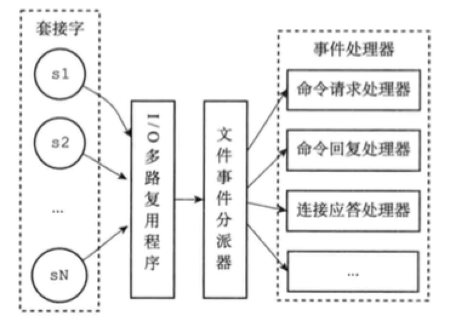

Redis服务器是一个事件驱动程序，需要处理以下两类事件：

- 文件事件（file event）：Redis服务器通过socket与客户端连接，文件事件就是对套接字操作的对象。服务器与客户端的通信会产生相应的文件事件，服务器监听并处理这些事件来完成一系列的网络通信操作。
- 时间事件（time event）：Redis服务器的一些操作（如`serverCron`函数）需要在特定时间点执行，时间事件就是对这类定时任务的抽象。

# 12. 1 文件事件

Redis基于Reactor模式开发了自己的网络事件处理器，称为『文件事件处理器』，文件事件处理器以单线程方式运行。

文件事件处理器的四个组成部分：

- 套接字。

  当被监听的套接字准备好执行accept、read、write、close等操作时，与操作相对应的文件事件就会产生。

- I/O多路复用程序。

  使用I/O多路复用程序同时监听多个套接字，并向文件分派器传送那些产生了事件的套接字（使用队列）。

- 文件事件分派器

  根据套接字的事件类型，调用相应的事件处理器。

- 事件处理器

## I/O多路复用程序的实现

Redis的I/O多路复用包装了常见的select、poll、evport和kqueue等函数库来实现的，每个函数库的在Redis源码中都有一个独立的文件。

## 事件的类型

I/O多路复用程序可以监听多个套接字的ae.h/AE_READABLE和ae.h/AE_WRITABLE事件。两种事件可以同时监听，但会优先处理AE_READABLE事件。

## API

| 函数                     | 参数                | 作用                                       |
| ---------------------- | ----------------- | ---------------------------------------- |
| ae.c/aeCreateFileEvent | 套接字描述符、事件类型、事件处理器 | 将给定套接字的给定事件加入到I/O多路复用程序的监听范围之内，并对事件和事件处理器进行关联 |
| ae.c/aeDeleteFileEvent | 套接字描述符、监听事件类型     | 让I/O多路复用程序取消套接字的事件监听，并取消事件与事件处理器的关联      |
| ae.c/aeGetFileEvent    | 套接字描述符            | 返回套接字正在被监听的事件类型，none、readable、writable   |
| ae.c/aeWait            | 套接字描述符、事件类型、毫秒数   | 在给定时间内阻塞并等待套接字的给定类型的事件发生                 |
| ae.c/aeApiPoll         | timeval结构         | 在给定事件内，阻塞并等待所有被acCreateFileEvent函数设置为监听状态的套接字产生文件事件 |
| ae.c/aeProcessEvents   |                   | 先调用aeApiPoll来等待事件，然后遍历所有事件，调用相应的事件处理器    |
| ae.c/aeGetApiName      |                   | 返回I/O多路复用程序底层使用的函数库名称：epoll、select等      |

## 文件事件的处理器

