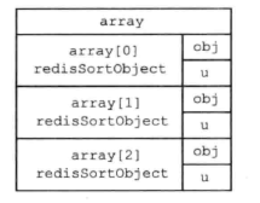

Redis的`SORT`命令可以对列表键、集合键或者有序集合键的值进行排序。

# 21.1 `SORT <key>`命令的实现

`SORT <key>` 可以对一个包含数字值的键key进行排序，假设：

> PRUSH numbers 3 1 2
>
> SORT numbers

1. 创建一个和numbers长度相同的数组，每个元素都是一个`redis.h/redisSortObject`结构。

   

2. 遍历数组，将每个元素的`obj`指针指向numbers列表的各个项，构成一一对应关系。

   

3. 遍历数组，将各个`obj`指针所指向的列表项转换为一个`double`类型的浮点数，并将这个浮点数保存在相应数组项的`u.score`属性中。

   

4. 根据数组项`u.score`的值，对数组进行数字值排序。

   

5. 遍历数组，将各个数组项的`obj`指针所指向的列表项作为排序结果返回给客户端。

```c
typedef struct _redisSortObject {
  // 被排序的值
  robj *obj;
  
  // 权重
  union {
    // 排序数字值时使用
    double score;
    
    // 排序带有BY选项的字符串值使用
    robj *cmpobj;
  } u;
} redisSortObject;
```

# 21.2 `ALPHA`选项的实现


# 导航

[目录](README.md)

上一章：[20. Lua脚本](20. Lua脚本.md)

下一章：