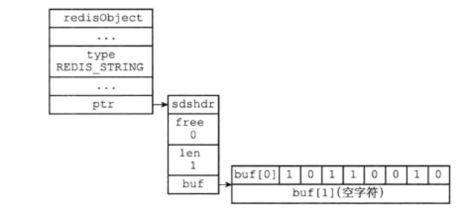

Redis提供了`SETBIT`、`GETBIT`、`BITCOUNT`、`BITOP`四个命令用于处理二进制位数组。

- `SETBIT`，为位数组指定偏移量上的二进制位设置值0或1。
- `GETBIT`，获取位数组指定偏移量上的二进制位的值。
- `BITCOUNT`，统计位数组中1的个数。
- `BITOP`，既可以对多个位数组进行按位与、按位或、按位异或运算，也可以对给定位数组取反。

# 22.1 位数组的表示

Redis使用字符串来表示位数组，并使用SDS结构的操作函数来处理位数组。

- `redisObject.type`的值为`REDIS_STRING`，表示字符串对象。
- `sdshdr.len`值为1，表示这个SDS保存了一个一字节长的位数组。
- `buf`数组的`buf[0]`字节保存了一个一字节长的位数组。
- `buf`数组的`buf[1]`字节保存了SDS程序自动追加到值的末尾的'\0'。

# 22.2 `GETBIT`命令的实现

> GETBIT <bitarray> <offset>

用于返回位数组`bitarray`在`offset`偏移量上的二进制位的值：

1. 计算 `byte = (offset / 8)`，`byte`记录了`offset`偏移量指定的二进制保存在位数组的哪个字节。
2. 计算 `bit = (offset mode 8) + 1`，`bit`记录`offset`指定的二进制位是`byte`字节的第几个二进制位。
3. 根据 `byte` 和 `bit` 值，在位数组 `bitarray`中定位`offset`指定的二进制位，并返回这个位的值。

# 22.3 `SETBIT`命令的实现

