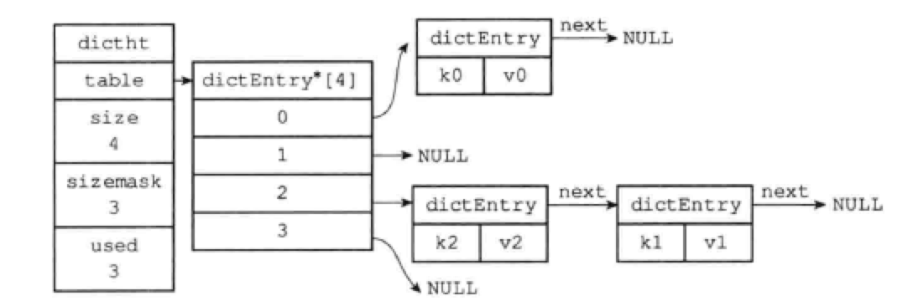

Redis的数据库就是使用字典来作为底层实现的，对数据库的增删改查都是构建在字典的操作之上。

字典还是哈希键的底层实现之一，但一个哈希键包含的键值对比较多，又或者键值对中的元素都是较长的字符串时，Redis就会用字典作为哈希键的底层实现。

# 4.1 字典的实现

Redis的字典使用**哈希表**作为底层实现，每个哈希表节点就保存了字典中的一个键值对。

Redis字典所用的**哈希表**由dict.h/dictht结构定义：

```c
typedef struct dictht {
  // 哈希表数组
  dict Entry **table;
  // 哈希表大小
  unsigned long size;
  // 哈希表大小掩码，用于计算索引值，总是等于size - 1
  unsigned long sizemask;
  // 该哈希表已有节点的数量
  unsigned long used;
} dictht;
```

**哈希表节点**使用dictEntry结构表示，每个dictEntry结构都保存着一个键值对：

```c
typedef struct dictEntry {
  void *key; // 键
  
  // 值
  union {
    void *val;
    uint64_t u64;
    int64_t s64;
  } v;
  
  // 指向下个哈希表节点，形成链表。一次解决键冲突的问题
  struct dictEntry *next;
}
```

 

Redis中的**字典**由dict.h/dict结构表示：

```c
typedef struct dict {
  dictType *type; // 类型特定函数
  void *privdata; // 私有数据
  
  /*
  哈希表
  一般情况下，字典只是用ht[0]哈希表，ht[1]只会在对ht[0]哈希表进行rehash时是用
  */
  dictht ht[2]; 
  
  // rehash索引，但rehash不在进行时，值为-1
  // 记录了rehash的进度
  int trehashidx; 
} dict;
```

type和privdata是针对不同类型大家键值对，为创建多态字典而设置的：

- type是一个指向dictType结构的指针，每个dictType都保存了一簇用于操作特定类型键值对的函数，Redis会为用途不同的字典设置不同的类型特定函数。
- privdata保存了需要传给那些类型特定函数的可选参数。

```c
typedef struct dictType {
  // 计算哈希值的函数
  unsigned int (*hashFunction) (const void *key);
  
  // 复制键的函数
  void *(*keyDup) (void *privdata, const void *obj);
  
  // 对比键的函数
  void *(*keyCompare) (void *privdata, const void *key1, const void *key2);
  
  // 销毁键的函数
  void (*keyDestructor) (void *privdata, void *key);
  
  // 销毁值的函数
  void (*valDestructor) (void *privdata, void *obj);
} dictType;
```

# 4.2 哈希算法

Redis计算哈希值和索引值的方法如下：

```python
# 使用字典设置的哈希函数，计算key的哈希值
hash = dict.type.hashFucntion(key)
# 使用哈希表的sizemask属性和哈希值，计算出索引值
# 根据情况的不同，ht[x]可以使ht[0]或ht[1]
index = hash & dict.ht[x].sizemask
```

当字典被用作数据库或哈希键的底层实现时，使用MurmurHash2算法来计算哈希值，即使输入的键是有规律的，算法人能有一个很好的随机分布性，计算速度也很快。

# 4.3 解决键冲突

Redis使用链地址法解决键冲突，每个哈希表节点都有个next指针。

 

# 4.4 rehash

随着操作的不断执行，哈希表保存的键值对会增加或减少。为了让哈希表的负载因子维持在合理范围，需要对哈希表的大小进行扩展或收缩，即通过执行rehash（重新散列）来完成：

1. 为字典的ht[1]哈希表分配空间：

   如果执行的是扩展操作，ht[1]的大小为第一个大于等于ht[0].used * 2 的2^n

   如果执行的是收缩操作，ht[1]的大小为第一个大于等于ht[0].used的2^n

2. 将保存在ht[0]中的所有键值对rehash到ht[1]上。rehash是重新设计的计算键的哈希值和索引值

3. 释放ht[0]，将ht[1]设置为ht[0]，并为ht[1]新建一个空白哈希表

## 哈希表的扩展与收缩

满足一下任一条件，程序会自动对哈希表执行扩展操作：

1. 服务器目前没有执行BGSAVE或BGREWRITEAOF，且哈希表负载因子大于等于1
2. 服务器正在执行BGSAVE或BGREWRITEAOF，且负载因子大于5

其中负载因子的计算公式：

```python
# 负载因子 = 哈希表已保存节点数量 / 哈希表大小
load_factor = ht[0].used / ht[0].size
```

注：执行BGSAVE或BGREWRITEAOF过程中，Redis需要创建当前服务器进程的子进程，而多数操作系统都是用写时复制来优化子进程的效率，所以在子进程存在期间，服务器会提高执行扩展操作所需的负载因子，从而尽可能地避免在子进程存在期间扩展哈希表，避免不避免的内存写入，节约内存。

# 4.5 渐进式rehash

将ht[0]中的键值对rehash到ht[1]中的操作不是一次性完成的，而是分多次渐进式的：

1. 为ht[1]分配空间
2. 在字典中维持一个索引计数器变量rehashidx，设置为0，表示rehash工作正式开始
3. rehash期间，**每次对字典的增删改查操作**，会顺带将ht[0]在rehashidx索引上的所有键值对rehash到ht[1]，rehash完成之后，rehashidx属性的值+1
4. 最终ht[0]会全部rehash到ht[1]，这是将rehashidx设置为-1，表示rehash完成

渐进式rehash过程中，字典会有两个哈希表，字典的增删改查会在两个哈希表上进行。

# 4.6 字典API

| 函数               | 作用              | 时间复杂度 |
| ---------------- | --------------- | ----- |
| dictCreate       | 创建一个新的字典        | O(1)  |
| dictAdd          | 添加键值对           | O(1)  |
| dictReplace      | 添加键值对，如已存在，替换原有 | O(1)  |
| dictFetchValue   | 返回给定键的值         | O(1)  |
| dictGetRandomKey | 随机返回一个键值对       | O(1)  |


