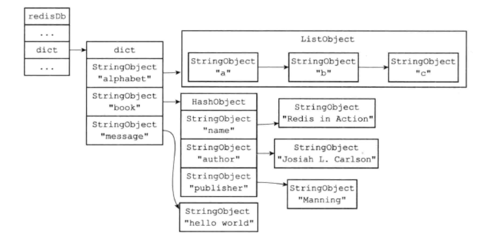
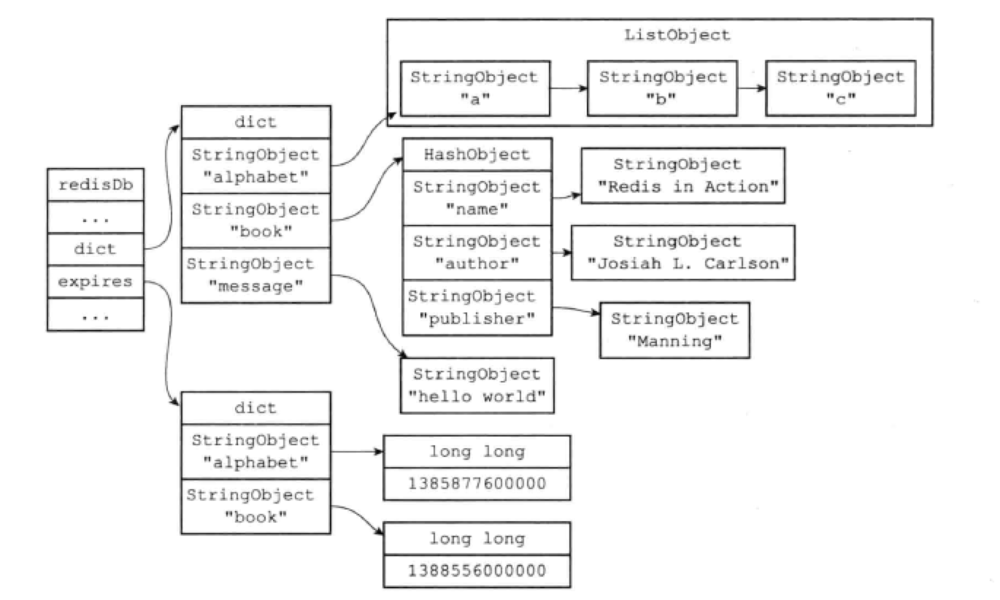

# 9.1 服务器中的数据库

Redis服务器将所有数据库都保存在服务器状态redis.h/redisServer结构的db数组中，数组的每个项都是一个redis.h/redisDb结构，每个redisDb结构代表一个数据库：

```c
struct redisServer {
  // ...
  redisDb *db;
  int dbnum; // 数据库的数量
  // ...
};
```

其中dbnum的值有服务器配置的database选项决定，默认为16。

# 9.2 切换数据库

默认情况下，Redis客户端的目标数据库是0号数据库，客户端可以执行SELECT命令来切换。

服务器内部，客户端状态redisClient结构的db属性记录了客户端当前的目标数据库：

```c
typedef struct redisClient {
  redisDb *db; // 指向redisServer.db数组中的一个元素
} redusClient;
```

# 9.3 数据库键空间

Redis是一个键值对（key-value pair）数据库服务器。redisDb结构的dict字典保存了数据库的所有键值对，这个字典就是键空间：

```c
typedef struct redisDb {
  // ...
  dict *dict;
  // ...
} redisDb;
```

键空间和用户所见的数据库是直接对应的：

- 键空间的键也就是数据库的键。每个键都是一个字符串对象。
- 键空间的值也是数据库的值。每个值可以使字符串对象、列表对象、哈希表对象、集合对象、有序集合对象。



所有针对数据库的操作，实际上都是通过键空间字典来实现。

## 添加新键

添加一个新键值对到数据库，就是将新键值对添加到键空间字典中。

## 删除键

删除数据库中的一个键，就是在键空间中删除键所对应的键值对对象。

## 更新键

更新数据库的一个键，就是对键空间里键所对应的值对象进行更新。根据值对象类型的不同，更新的具体方法也不同。

## 对键取值

对一个数据库键取值，就是在键空间中取出键所对应的值对象。

## 读写键空间时的维护操作

当Redis对数据库读写时，不仅对键空间执行指定的操作，还会执行一些额外的维护：

1. 读取一个键后，更新服务器的键命中次数或不命中次数。这两个值可通过INFO stats命令查看。
2. 读取一个键后，更新LRU时间。OBJECT idletime \<key\>查看。
3. 读取键时发现已过期，删除。
4. 如果有客户端WATCH了某个键，修改后将键标记为dirty，从而让事物程序注意到它。
5. 每次修改一个键后，将dirty键计数器的值+1，这个计数器会触发服务器的持久化和赋值操作。
6. 如果服务器开启了通知功能，键修改后，服务器会按照配置发送通知。

# 9.4 设置键的生存时间或过期时间

`EXPIRE`或`PEXPIRE`命令让客户端可以以秒或者毫秒进度为某个键设置生存时间。经过指定的时间后，服务器会自动删除生存时间为0的键。

`EXPIREAT`或`PEXPIREAT`命令，以秒或毫秒精度为某个键设置过期时间，过期时间是一个UNIX时间戳。

`TTL`和`PTTL`命令可查看某个键的剩余生存时间。

实际上，`EXPIRE`、`PEXPIRE`、`EXPIREAT`三个命令都是使用`PEXPIREAT`来实现的。

## 保存过期时间

redisDb结构的expires字典保存了所有键的过期时间：

- 过期字典的键是一个指针，指向键空间中的某个键对象。
- 过期字典的值是一个`long long`类型的整数，保存了一个UNIX时间戳。

```c
typedef struct redisDb {
  // ...
  dict *expires;
  // ...
} redisDb;
```



`PEXPIREAT`的伪代码定义：

```python
def PEXPIREAT(key, expire_time_in_ms):
    # 如果键不存在于键空间，那么不能设置过期时间
    if key not in redisDb.dict:
        return 0
    # 在过期字典中关联键和过期时间
    redisDb.expires[key] = expire_time_in_ms
    # 设置成功过
    return 1
```

## 移除过期时间

`PERSIST`可以移除一个键的过期时间，它在过期字典中找到给定的键，解除键和值（过期时间）的关联。

```python
def PERSIST(key):
    # 如果键不存在或者没有设置过期时间
    if key not in redisBb.expires:
        return 0
    redisDb.expires.remove(key)
    return 1
```

## 计算并返回剩余生存时间

`TTL`和`PTTL`都是通过计算键的过期时间和当前时间的差来实现的：

```python
def PTTL(key):
    if key not in redisDb.dict:
        return -2
    expire_time_in_ms = redisDb.expires.get(key)
    
    if expire_time_in_ms is None:
        return -1
    
    now_ms = get_current_unix_timestamp_in_ms()
    return expire_time_in_ms - now_ms
```

## 过期键的判定

通过过期字典，程序可通过以下步骤来判定键是否过期：

1. 检查给定键是否存在于过期字典，如果存在，取得其过期时间
2. 检查当前UNIX时间戳是否大于其过期时间

# 9.5 过期键的删除策略

有三种不同的键删除策略：

| 策略   | 操作                                       | 优点               | 缺点             |
| ---- | ---------------------------------------- | ---------------- | -------------- |
| 定时删除 | 设置键的过期时间的同时，创建一个定时器，让定时器在键的过期时间来临时立即执行删除操作。 | 对内存最友好，保证会尽快释放内存 | 对CPU时间不友好      |
| 惰性删除 | 每次从键空间获取键时，检查其是否过期，过期则删除；否则就返回该键。        | 对CPU时间最友好        | 对内存不友好         |
| 定期删除 | 每隔一段时间，对数据库进行一次检查，删除所有的过期键。              | 上述两种策略的整合和折中     | 难点在于确定删除的时长和频率 |

# 9.6 Redis的过期键删除策略

Redis服务器使用的是惰性删除和定期删除两种策略。

## 惰性删除的实现

惰性删除的策略由db.c/exipireIfNeeded函数实现，所有读写数据库的Redis命令都会在执行前调用该函数。


## 定期删除的实现

定期删除的策略由redis.c/activeExpireCycle函数实现，每当Redis服务器周期性操作redis.c/serverCron函数执行时，该函数会被调用。它在规定时间内，分多次遍历各个数据库，检查过期时间并删除过期键。

```python
DEFAULT_DB_NUMBERS = 16
DEFAULT_KEY_NUMBERS = 20
current_db = 0

def activeExpireCycle():
    if server.dbnum < DEFAUKT_DB_NUMBERS:
        db_numbers = server.dbnum
    else:
    	db_numbers = DEFAULT_DB_NUMBERS
       
    for i in range(db_numbers):
        if current_db == server.dbnum:
            current_db = 0
           
        redisDb = server.db[current_db]
        current_db += 1
        
        for j in range(DEFAULT_KEY_NUMBERS):
            if redisDb.expires.size() == 0:
                break
                
            key_with_ttl = redisBb.expires.get_random_key()
            if is_expired(key_with_ttl):
                delete_key(key_with_ttl)
                
            if reach_time_limit(): 
                return
        
```

activeExpireCycle的工作模式总结如下：

- 函数运行时，会从一定数量的数据库中取出一定数量的随机键检查并删除。
- 全局变量current\_db记录当前检查的进度，并在下一次调用时接着处理上一次的进度。
- 随着activeExpireCycle的不断执行，所有数据库都会被检查一遍，这是current\_db重置为0，再次开始新一轮动机检查。

# 9.7 AOF、RDB和复制功能对过期键的处理

